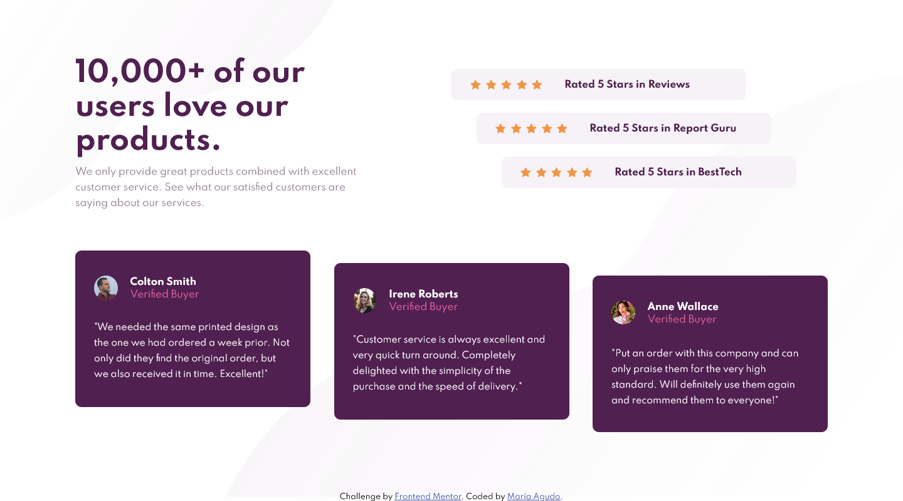

# Frontend Mentor - Social proof section solution

This is a solution to the [Social proof section challenge on Frontend Mentor](https://www.frontendmentor.io/challenges/social-proof-section-6e0qTv_bA). Frontend Mentor challenges help you improve your coding skills by building realistic projects. 

## Table of contents

  - [The challenge](#the-challenge)
  - [Screenshot](#screenshot)
  - [My process](#my-process)
  - [Built with](#built-with)
  - [What I learned](#what-i-learned)
  - [Continued development](#continued-development)
  - [Useful resources](#useful-resources)
  - [Author](#author)

### The challenge

Users should be able to:

- View the optimal layout for the section depending on their device's screen size

### Screenshot

## My process

This is my fourth challenge and this one was my favorite, I finally feel like I'm improving and I feel more confident with everything I do.

### Built with

- Semantic HTML5 markup
- CSS custom properties
- Flexbox
- CSS Grid

### What I learned

I learned more about grid in this challenge. 

### Continued development

I still need to learn Responsive Design and Mobile First. 

### Useful resources

- [W3Schools](https://www.w3schools.com) - If I ever forget anything, this page is the best 

## Author

- Github - [@mdagudo](https://github.com/mdagudo.com)
- Frontend Mentor - [@mdagudo](https://www.frontendmentor.io/profile/mdagudo)

